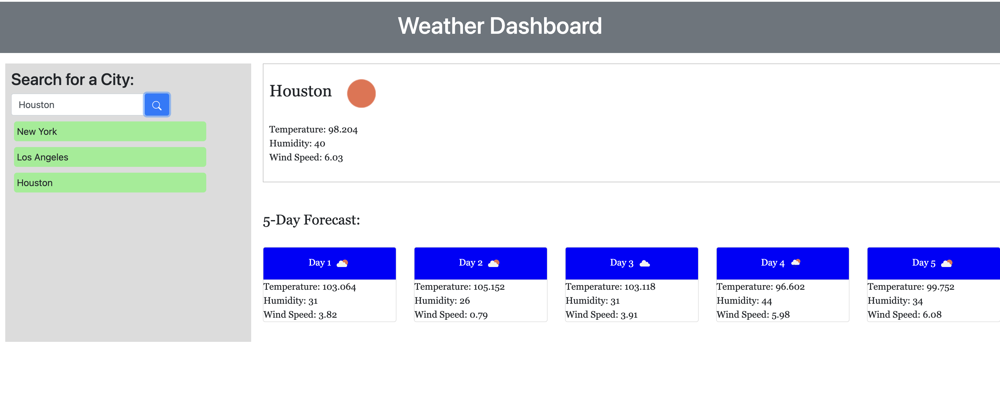
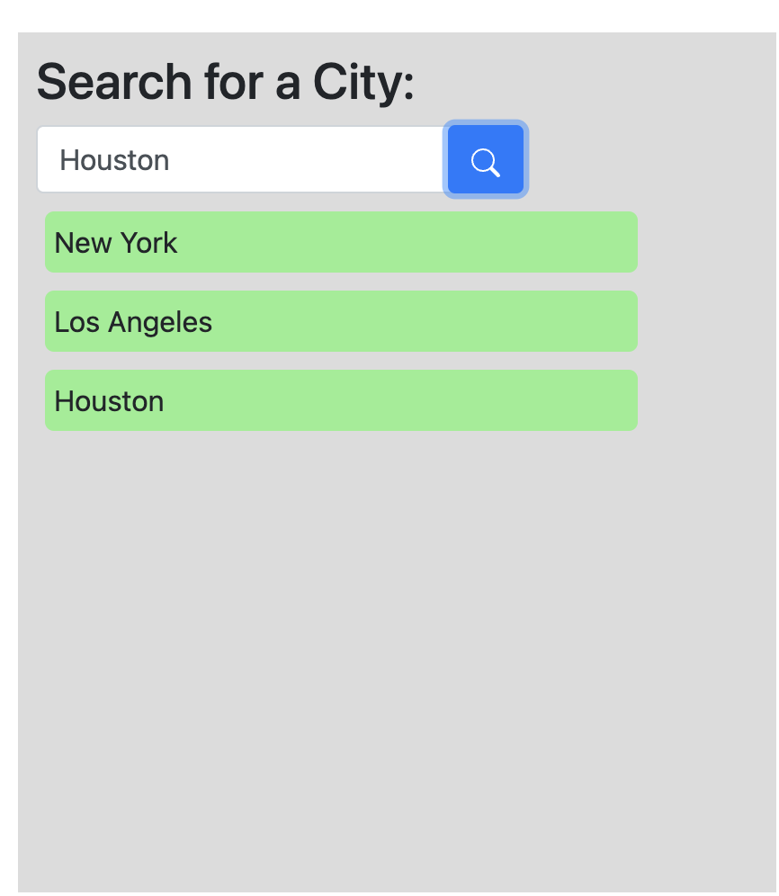
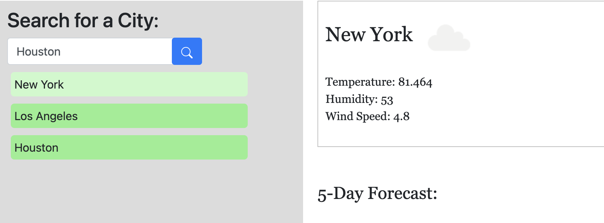

# 06 Server-Side APIs: Weather Dashboard

## Description

* As a developer, I wanted to create a web application that would generate the current weather and five day forecast by making a call to a weather API.


## Acceptance Criteria

```
GIVEN a weather dashboard with form inputs
WHEN I search for a city
THEN I am presented with current and future conditions for that city and that city is added to the search history
WHEN I view current weather conditions for that city
THEN I am presented with the city name, the date, an icon representation of weather conditions, the temperature, the humidity, and the wind speed
WHEN I view future weather conditions for that city
THEN I am presented with a 5-day forecast that displays the date, an icon representation of weather conditions, the temperature, the wind speed, and the humidity
WHEN I click on a city in the search history
THEN I am again presented with current and future conditions for that city
```

## Usage

* This webpage can be used to generate the current weather conditions for a given city, as well as its five-day forecast in fahrenheit for cities in the US and celsius for global.

* Link: https://candaceg00.github.io/SSAPIs_WeatherDashboard/

* Screenshots:
    
    
    